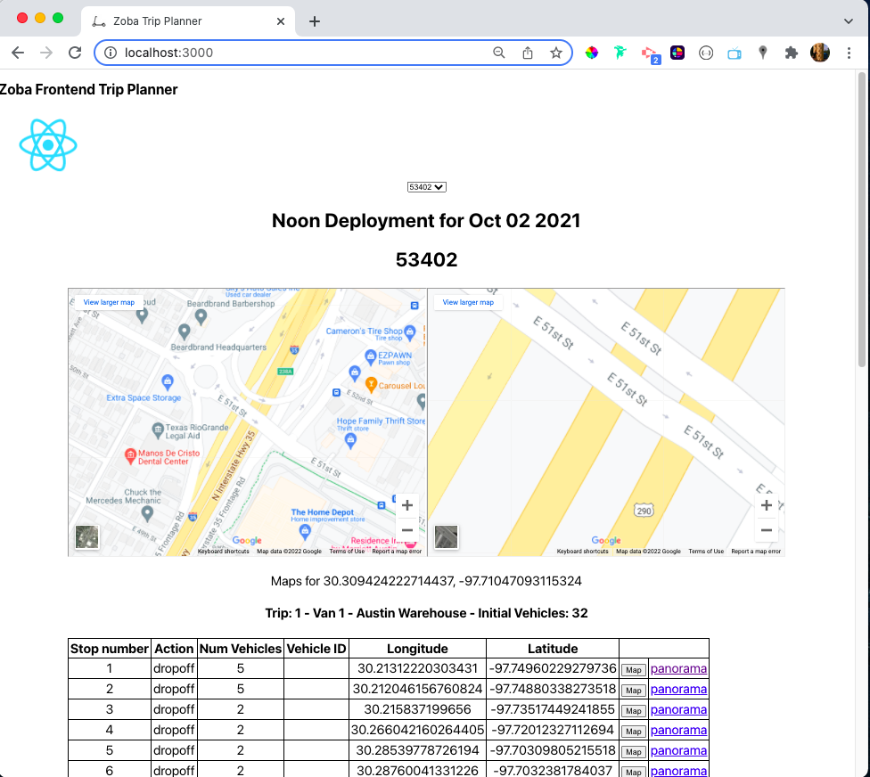

## Zoba Frontend Project
This is a simple web application to display four optimized trip recommendations to operators of micromobility networks of vehicles such as bicycles and scooters.  All recommendations come from the [Zoba](https://www.zoba.com/) API.  

Operators will act on these recommendations to physically move through the city to pick up and drop off vehicles or replace batteries.

A plan consists of one or more trips.  A trip leaves from a warehouse with an inventory of vehicles and is made up of multiple stops.  

## Design notes
The interface is intentionally simple, following the instruction to focus on usability and user experience over design.

## Operation

### `npm install`

Download the .zip file zoba-plan-recommendation.zip and extract to a directory. In that directory run `npm install` from the terminal.

### `npm start`

Runs the app in the development mode.  Open [http://localhost:3000](http://localhost:3000) to view it in your browser.

### `npm test`

Launches the test runner in the interactive watch mode. See the section about [running tests](https://facebook.github.io/create-react-app/docs/running-tests) for more information.

## API
This project uses data from the Zoba API at https://api.zoba.com/.

## Tech/framework used
This project was bootstrapped with [Create React App](https://github.com/facebook/create-react-app) by Jeff Korenstein.

## Here is a screenshot

## Credits
- [Fetching data from an API](https://www.youtube.com/watch?v=o7c_RRUTQHo)

- [Using a fetch inside another fetch in javascript](https://stackoverflow.com/questions/40981040/using-a-fetch-inside-another-fetch-in-javascript)

- [Adding jwt token to GET request not working in React](https://stackoverflow.com/questions/52870660/adding-jwt-token-to-get-request-not-working-in-react)

- [React - Select Tag (for dropdown menu)](https://reactjs.org/docs/forms.html#the-select-tag)

- [A Simple Explanation of React.useEffect()](https://dmitripavlutin.com/react-useeffect-explanation/)

- [What parameters should I use in a Google Maps URL to go to a lat-lon?](https://stackoverflow.com/questions/2660201/what-parameters-should-i-use-in-a-google-maps-url-to-go-to-a-lat-lon)